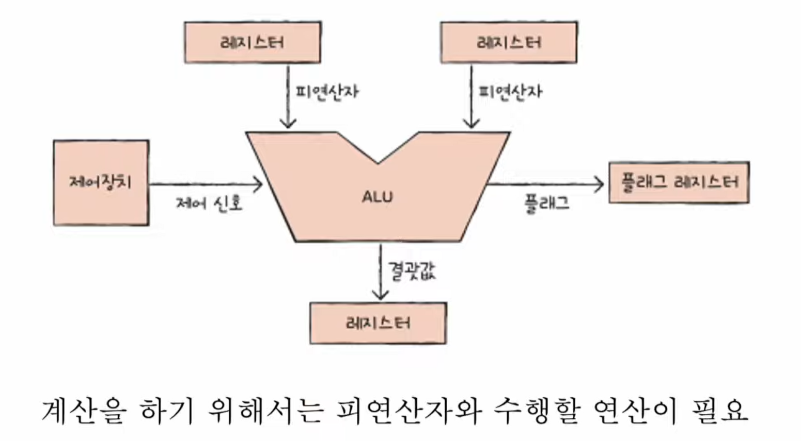
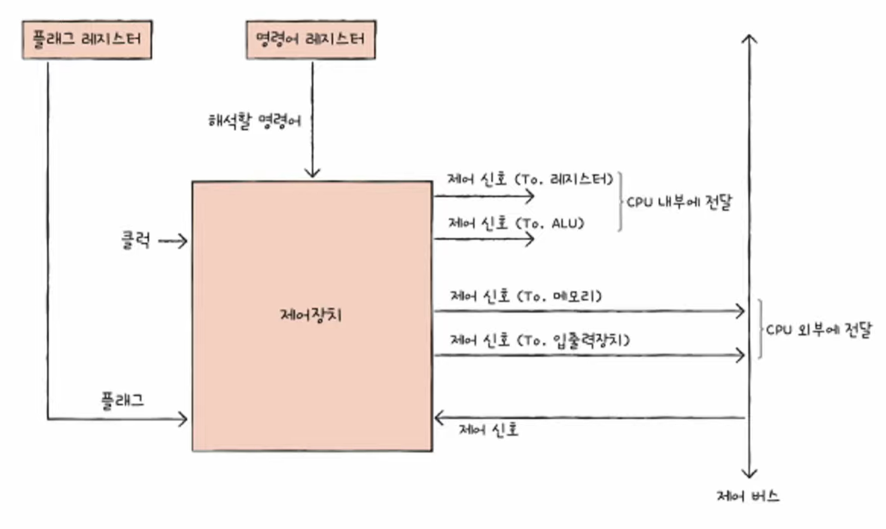

# **챕터 04. CPU의 작동 원리**

## ALU와 제어장치

### ALU

받아들이는 정보
- 피연산자 : 레지스터를 통하여
- 제어신호 : 제어장치로부터 수행할 연산자를 알려줌
내보내는 정보
- 계산 결과
- 플래그
- 대표적인 플래그
    - 부호 플래그: 연산한 결과의 부호를 나타냄.
    - 제로 플래그: 연산 결과가 0인지 여부를 나타냄.
    - 캐리 플래그: 연산 결과 올림수나 빌림수가 발생했는지를 나타냄.
    - 오버플로우 플래그: 오버플로우가 발생했는지를 나타냄.
    - 인터럽트 플래그: 인터럽트가 가능한지를 나타냄.
    - 슈퍼바이저 플래그: 커널 모드로 실행 중인지, 사용자 모드로 실행 중인지를 나타낸다.
- 플래그는 `플래그 레지스터`에 저장된다

### 제어장치

받아들이는 정보(4개)
- 클럭 신호
  - 클럭이란 CPU의 속도를 나타내는 단위로 제어 신호의 최소 주기를 나타낸다.
  - (주의) 모든 클럭의 명령어 사이클이 단일 클럭 주기로 동작되는 것은 아니다.
- 명령어
  - 수행해야 할 명령어를 명령어 레지스터로부터 가져와 해석한 뒤, 명령어 처리를 위한 제어 신호를 발생시킨다.
- 플래그 레지스터 속 플래그 값
  - ALU 연산에 대한 상태 정보인 플래그 값을 확인한 뒤, 제어 신호를 발생시킨다.
- 시스템버스, 그중에서 제어 버스로 전달된 제어 신호
  - 제어 신호는 CPU뿐만 아니라 입출력장치를 비롯한 외부 장치도 발생시킬 수 있다.
  - 제어장치는 제어 버스를 통해 외부로 전달된 제어 신호를 받아들인다.

내보내는 정보
- `CPU 내부`에 제어 신호 발생 (ALU, 레지스터 등)
  - ALU에는 수행할 연산을 지시
  - 레지스터에는 레지스터 간의 데이터 이동이나 명령어를 해석
- `CPU 외부`에 제어 신호 발생 (메모리, 입출력장치 등)
  - 입출력

## 레지스터

### 반드시 알아야 할 레지스터

프로그램 카운터
- 메모리에서 가져올 명령어의 주소를 저장하는 레지스터
- CPU에 따라 명령어 포인터(IP, Instruction Pointer)라고 불리기도 함

메모리 주소 레지스터
- 메모리의 주소를 저장하는 레지스터
- CPU가 읽어 들이고자 하는 주소 값을 주소 버스로 보낼 때 이 메모리 주소 레지스터를 거치

메모리 버퍼 레지스터
- 메모리와 주고 받을 값(데이터와 명령어)을 저장하는 레지스터
- CPU가 주소 버스로 내보낼 값이 메모리 주소 레지스터를 거친다면, 데이터 버스로 주고 받을 값은 메모리 버퍼 레지스터를 통과함
- 메모리 데이터 레지스터(MDR, Memoery Data Register)라는 명칭으로도 사용됨

명령어 레지스터
- 방금 메모리에서 읽어 들인 명령어를 저장하는 레지스터
- 제어장치에서 해석할 명령어를 이 명령어 레지스터에서 가져옴

플래그 레지스터
- ALU 연산 결과에 대한 부가적인 상태 정보인 플래그를 저장하는 레지스터.
- 대표적으로 부호 플래그, 제로 플래그, 캐리 플래그, 오버플로우 플래그, 인터럽트 플래그 등이 있음

범용 레지스터
- 데이터와 주소를 모두 저장할 수 있는 범용 레지스터.
- 대부분 CPU 내에 여러 개의 범용 레지스터를 갖고 있고, 일반적인 상황에서 자유롭게 사용할 수 있음.

스택 포인터
- 스택의 꼭대기 위치에 있는 주소 정보를 저장하는 레지스터.
- 스택 주소 지정 방식에서 사용됨.

베이스 레지스터
- 기준 주소를 저장하는 레지스터
- 상대 주소 지정 방식 중 베이스 레지스터 주소 지정 방식에 사용.

특정 레지스터를 이용한 주소 지정 방식
1. 스택 주소 지정 방식
- 스택과 스택 포인터를 이용한 주소 지정 방식.
  - 스택 포인터란 스택의 가장 마지막에 저장된 값의 위치
  - 스택은 메모리 내에 스택 영역이라는 곳에 존재

2. 변위 주소 지정 방식
`오퍼랜드 필드`의 값과 `특정 레지스터의 값`을 더하여 유효 주소를 얻어내는 주소 지정 방식  
`오퍼랜드 필드`의 주소와 어떤 `레지스터의 값을 더하는지`에 따라 `상대 주소 지정 방식`과 `베이스 레지스터 주소 지정 방식` 등이 존재한다.

- 상대 주소 지정 방식
  - 오퍼랜드와 프로그램 카운터의 값을 더하여 유효 주소를 얻는 방식
  - if문과 유사하게 모든 코드를 실행하는 것이 아닌, 분기하여 특정 주소의 코드를 실행할 때 사용
- 베이스 레지스터 주소 지정 방식
  - 오퍼랜드와 베이스 레지스터의 값을 더하여 유효 주소를 얻는 방식

## 명령어 사이클과 인터럽트
명령어 사이클 : 하나의 명령어를 처리하는 정형화된 흐름  
인터럽트 : 간혹 끊어지는 것

### 명령어 사이클
일반적으로 인출 사이클과 실행 사이클이 반복됨

- 인출 사이클: 메모리에 있는 명령어를 CPU로 가지고 오는 단계
- 실행 사이클: CPU로 가져온(인출된) 명령어를 실행하는 단계
- 간접 사이클: 주소 지정 방식과 같이 메모리에 접근이 필요한 경우 메모리에 있는 데이터를 CPU로 가지고 오는 단계
- 인터럽트 사이클: 인터럽트가 발생한 경우, 인터럽트 서비스 루틴을 처리하는 단계

### 인터럽트
- 동기 인터럽트
  - CPU에 의해 발생하는 인터럽트
  - CPU가 명령어들을 수행하다가 예기치 못한 오류가 발생했을 때 발생
  - 동기 인터럽트는 예외(Exception)이라는 표현을 하기도 함
  
- 비동기 인터럽트
  - 입출력 장치에 의해 발생하는 인터럽트
  - 대부분 인터럽트라 하면 비동기 인터럽트 이며, 하드웨어 인터럽트 라고 하기도 함
  - 입출력장치는 CPU보다 속도가 현저히 느리기 때문에 비동기 방식으로 인터럽트를 발생

- 하드웨어 인터럽트 처리 순서
  1. 입출력장치는 CPU에 인터럽트 요청 신호를 보낸다
  2. CPU는 실행 사이클이 끝나고 명령어를 인출하기 전 항상 인터럽트 여부를 확인한다
  3. CPU는 인터럽트 요청을 확인하고 인터럽트 플래그를 통해 현재 인터럽트를 받아들일 수 있는지 여부를 확인한다
  4. 인터럽트를 받아들일 수 있다면 CPU는 지금까지의 작업을 백업한다
  5. CPU는 인터럽트 벡터를 참조하여 인터럽트 서비스 루틴을 실행한다
  6. 인터럽트 서비스 루틴 실행이 모두 끝나면 (4) 에서 백업해 둔 작업을 복구하여 실행을 재개한다

- 인터럽트 요청 신호
CPU에 알리는 요청 신호

- 인터럽트 플래그
  - CPU가 현재 인터럽트를 처리할 수 있는지 여부
  - 1: aivle, 0: unaivle
  - 0일경우는 무시하지만 일부 무시할 수 없는것도 있음
    - 무시할 수 없는것 : 우선순위가 가장 높은 인터럽트, 정전이나 하드웨어 고장 등의 인터럽트

- 인터럽트 서비스 루틴(인터럽트 핸들러)
  - 인터럽트 작동하고 처리를 위한 프로그램 

- 인터럽트 벡터
  - 인터럽트 서비스 루틴을 식별하기 위한 정보 (시작 주소)
  - CPU는 하드웨어 인터럽트 요청을 보낸 대상으로부터 데이터 버스를 통해 인터럽트 벡터를 전달 

### 예외의 종류
예외가 발생하면 CPU는 예외를 처리해야함.
이에대한 처리방식으로는 예외가 발생한 명령어부터 실행하느냐 vs 다음 명령어부터 실행하느냐는 `폴트`와 `트랩`으로 나뉨

 