# **챕터 04. CPU 성능 향상 기법**

## 빠른 CPU를 위한 설계 기법

### 클럭
- 컴퓨터 부품들은 클럭속도에 맞춰 움직임
- CPU는 명령어 사이클이라는 정해진 흐름에 맞춰 명령어들을 실행함
- 클럭속도는 기본적으로 HZ(헤르츠)단위로 측정하며 이는 1초에 클럭이 몇번 반복되는지를 나타냄
- 일반적으로는 클럭속도가 높으면 빠른 성능을 보이지만 발열등의 이유로 반듯이 클럭수가 높다고 높은 성능을 보장하지는 않음

### 코어와 멀티 코어
멀티코어 - 코어를 여러개 가지고있는 코어

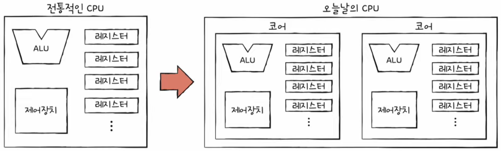

- 코어를 무작정 많이 늘린다고해서 연산속도가 꼭 코어수에 비례하여 증가하지는 않는다.(작업량이 균등하지 않을 수 있기때문)
- 처리하는 작업량이 적으면 무작정 많은 코어가 효율을 내지 못함

### 스레드와 멀티 스레드
- 스레드 : 사전적으로는 실행 흐름의 단위를 나타냄
  - 하드웨어 스레드 : 하나의 코어가 동시에 처리할 수 있는 명령어의 단위
  - 소프트웨어 스레드 : 하나의 프로그램에서 독립적으로 실행되는 단위

- 하드웨어 스레드
  
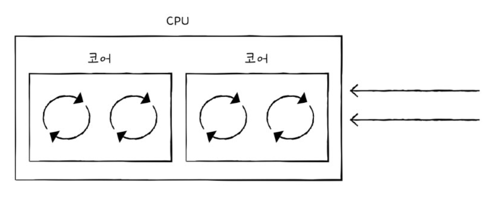

  - 위와같이 하나의 코어가 여러 명령어를 동시에 처리하는 CPU
  - 멀티스레드 프로세서 혹은 멀티스레드 CPU라고 부름

- 소프트웨어 스레드
  
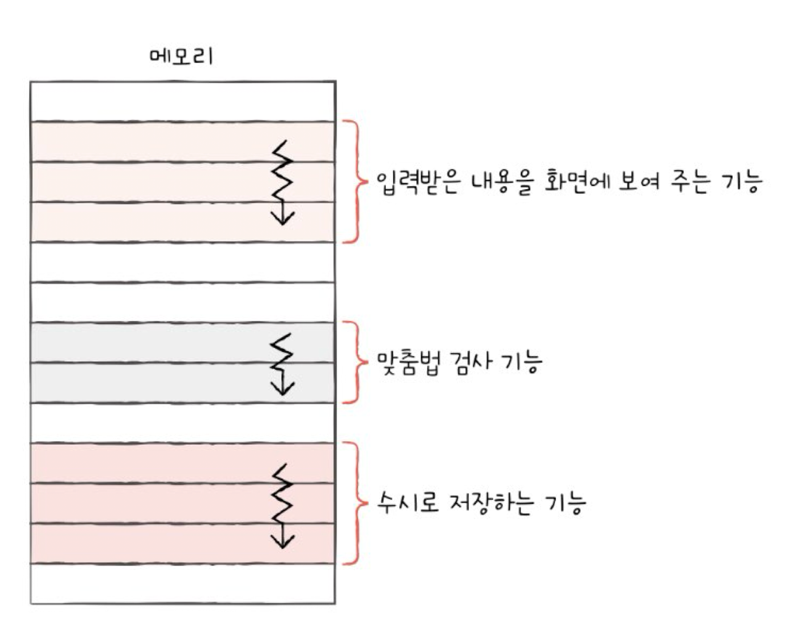

  - 하나의 프로그램에서 독립적으로 실행되는 단위를 의미한다

- 멀티스레드 프로세서
  
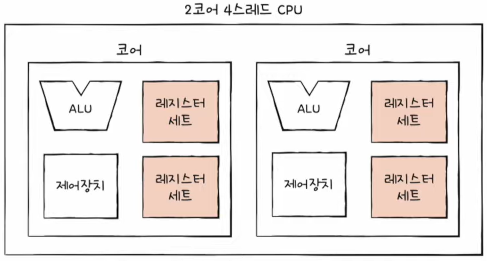

  - 멀티스레드 프로세서의 가장 큰 핵심은 레지스터의 개수임
  - 프로그램 입장에서 봤을때는 한번에 하나의 명령어를 처리하는 CPU가 여러개 있는것처럼 보여 하드웨어 스레드는 논리 프로세서라고 부르기도 함
  
## 명령어 병렬 처리 기법

### 명령어 파이프 라인
명령어 처리 과정을 클럭 단위로 나우어 보면 일반적으로 아래와 같다
  

  1. 명령어 인출(Instruction Fetch)
  2. 명령어 해석(Instruction Decode)
  3. 명령어 실행(Excute Instruction)
  4. 결과 저장(Write Back)
  
  - 여기서 중요한 점은 같은 단계가 겹치지만 않는다면 CPU는 각 단계를 동시에 실행할 수 있다는 것이다
    
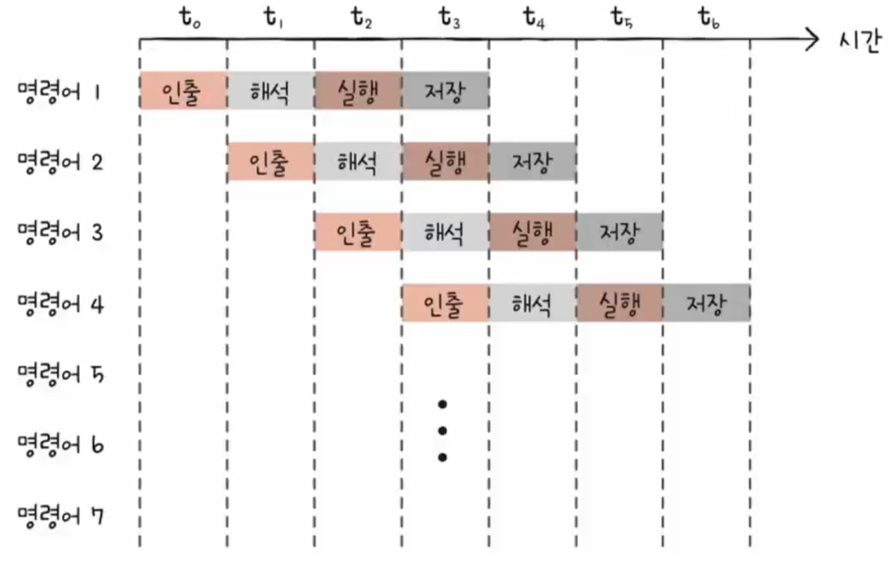

  
  - 명령어 파이프 라이닝 : 마치 공장 생산 라인과 같이 명령어들을 명령어 파이프 라인에 넣고 동시에 처리하는 기법
  - 파이프라인 위험 : 특정 상황에서는 동시 실행이 불가능한 경우
    
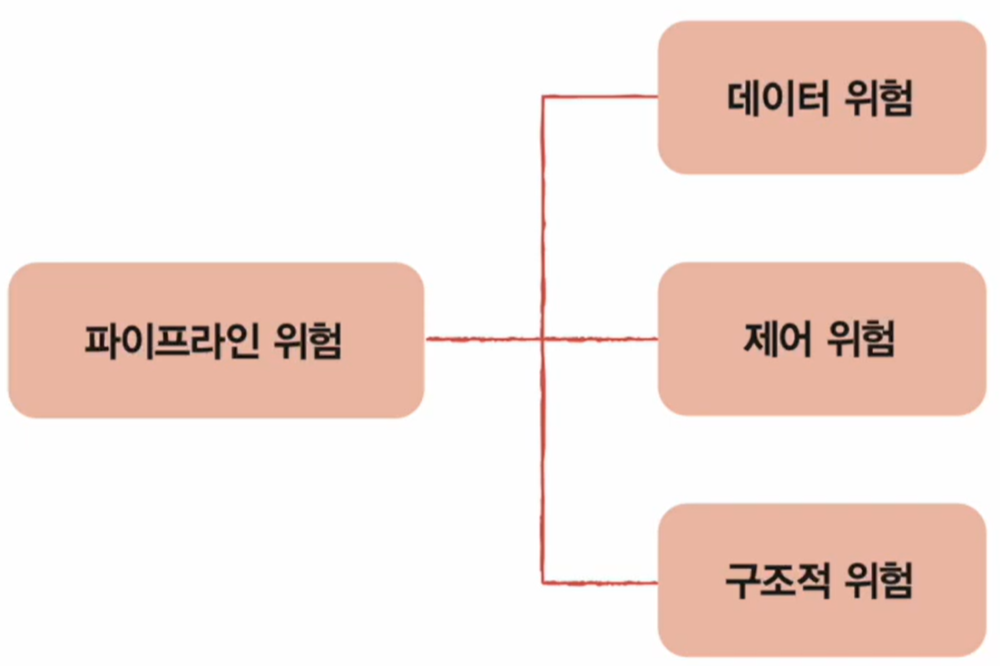

    - 데이터 위험 : 명령어간 데이터 의존성에 의해 발생함
      

      - 현재 명령어 2는 명령어 1에 의존적임

    - 제어 위험 : 프로그램 카운터의 갑작스러운 변화에 의해 발생함
      
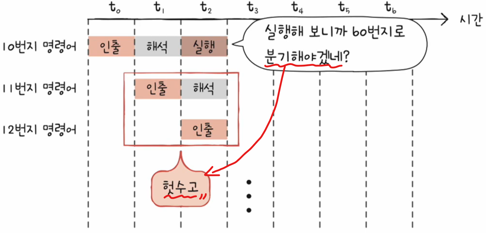

      - 이를 보완하기 위해 프로그램이 어디로 분기할지 미리 예측한 후 그 주소를 인출하는 기술을 분기 예측(branch prediction)이라고 함

    - 구조적 위험(자원 위험) : 명령어들을 겹쳐 실행하는 과정에서 서로 다른 명령어가 동시에 ALU, 레지스터 등과 같은 CPU 자원을 사용하려고 할 때 발생함

### 슈퍼 스칼라
- 대부분의 CPU에서는 아래와 같이 여러 개의 명령어 파이프라인을 구성
  
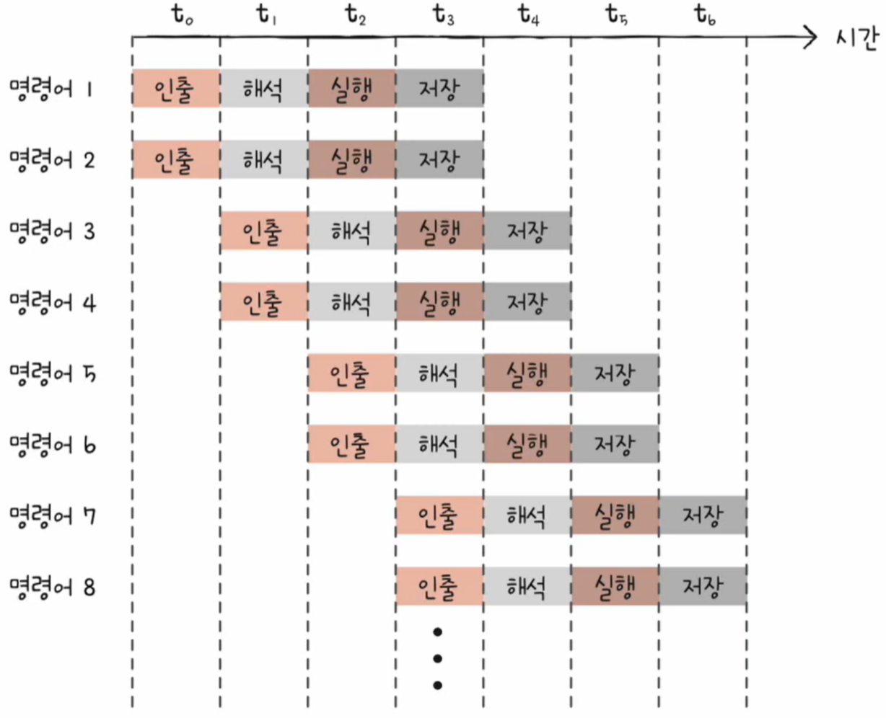

- 매 클럭 주기마다 동시에 여러 명령어의 인출, 해석, 실행할 수 있어야 함

### 비순차적 명령어 처리
- 명령어들을 비순차적으로 실행하여 아래와 같이 CPU를 최대한 효율적으로 활용하는 기법
  
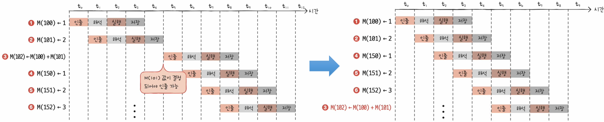

  - 명령어 파이프라인이 멈추는 것을 방지하는 기법

## CISC와 RISC

### 명령어 집합
- 명령어 집합 구조(ISA) / 명령어 집합(Instruction Set) : CPU가 이해할 수 있는 명령어들의 모음
- ISA가 다르면 제어장치가 명령어를 해석하는 방식, 사용되는 레지스터 종류의 개수, 메모리 관리 방법, 그리고 CPU 하드웨어 설계에도 큰 영향을 끼침
- 현대 ISA의 양대 산맥에는 CISC와 RISC가 있음

### CISC (Complex Instruction Set Computer)

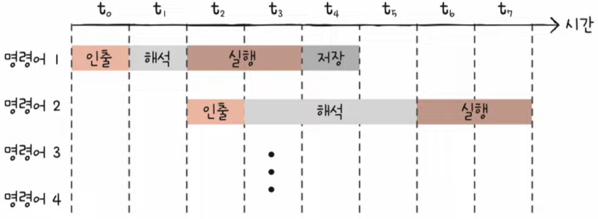

- 복잡하고 다양한 명령어들을 활용하는 CPU 설계 방식
- 명령어의 형태와 크기가 다양한 가변 길이 명령어를 활용
- 다양하고 강력한 명령어 활용 -> 적은 수의 명령어로 프로그램 실행 -> 메모리 절약이 가능
- 그러나 이것은 단점으로 아래와 같이 작용한다.
  - 복잡한 가변 길이 명령어 -> 실행 시간 길고 일정치 않음(여러 클럭 주기 필요) -> 명령어 파이프라이닝 어려움

### RISC (Reduced Instruction Set Computer)

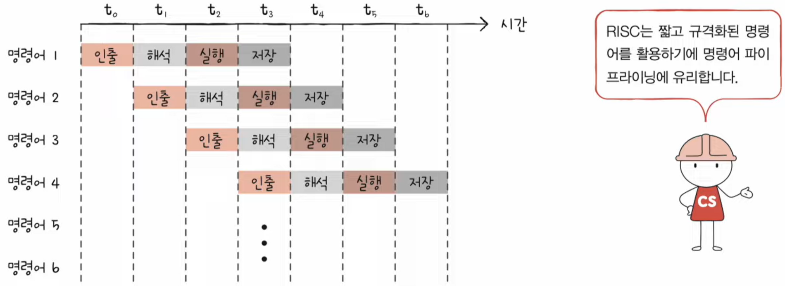

-  단순하고 적은 명령어를 활용하는 CPU 설계 방식
- 명령어 길이와 수행 시간이 짧고 규격화 되어있음
- 자주 쓰이는 기본적인 명령어를 작고 빠르게 만드는 것을 중점적으로 함
- 주소 지정 방식의 종류가 적은 경우가 많음
- 고정 길이 명령어
- 메모리 직접 접근 명령어를 load와 store 두 개로 제한할 만큼 단순화하고 최소화 함
- 메모리 접근을 단순화, 최소화하는 대신 레지스터를 적극적으로 활용
- CISC보다 프로그램 용량은 많이 사용함
