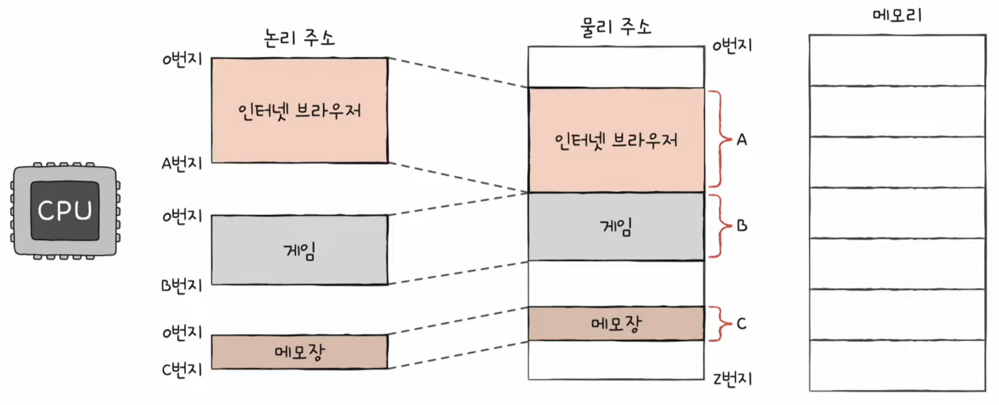
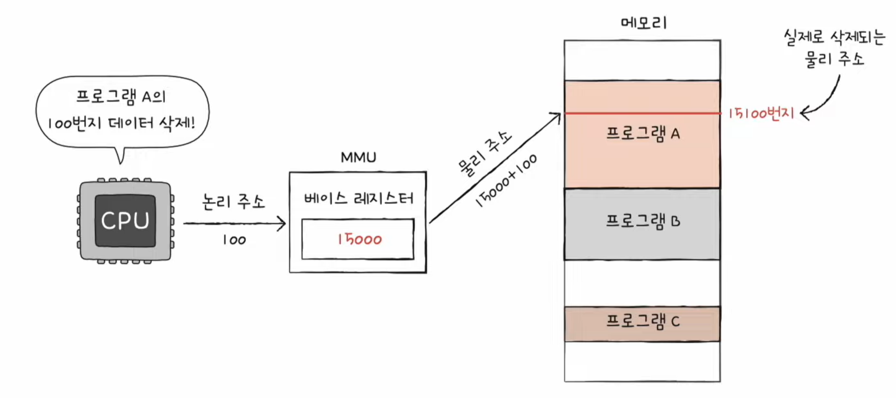
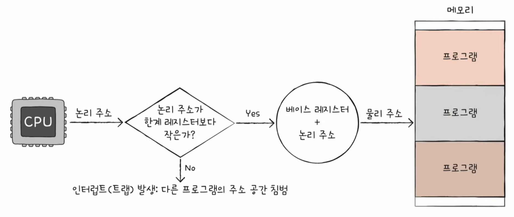
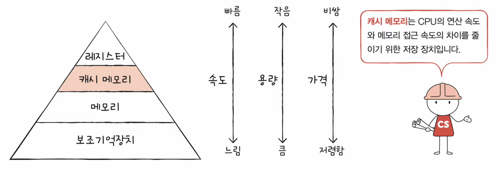
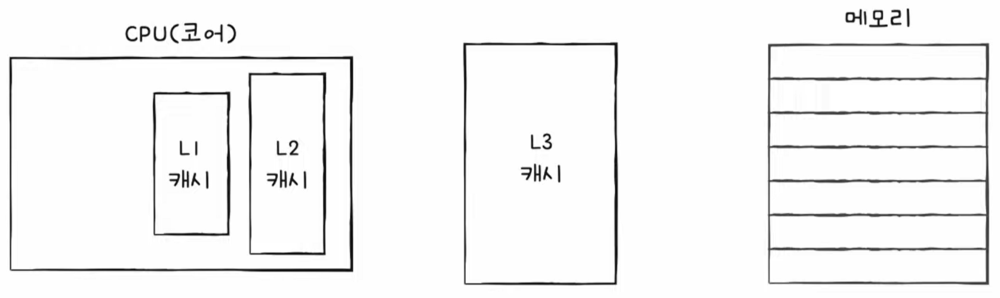

# **챕터 04. CPU의 작동 원리**

## RAM의 특징과 종류

### RAM의 특징
- 휘발성 저장장치 : 실행할 대상을 저장

### RAM의 용량과 성능
- 램 용량은 다다익선이지만 무조건 비례해서 성능이 좋아지는 것은 아님
- 램과 CPU의 레이턴시의 차이는 램 용량과 차이가 없기 때문

### RAM의 종류
1. DRAM(Dynamic RAM)
  - 시간이 지나면 데이터가 사라짐
  - 일반적으로 사용하는 램(소비전력 낮음, 저렴함, 집적도가 높음-> 대용량 설계 용이)
2. SRAM(Static RAM)
  - 저장된 데이터가 변하지 않음
  - DRAM보다 속도가 빠름
  - 정확히 DRAM의 장점을 모조리 단점으로 가지고 있음
3. SDRAM(Synchronous Dynamic RAM)
  - 클럭신호랑 동기화된 램
4. DDR SDRAM(Double Data Rate RDRAM)
  - 가장 흔히 사용되는 램
  - 대역폭을 넓혀 속도를 빠르게 만든 램

## 메모리의 주소 공간

### 물리주소와 논리 주소

물리적 주소 : 메모리 하드웨어가 사용하는 주소
논리 주소 : CPU와 실행중인 프로그램이 사용하는 주소

- 메모리 관리장치 (MMU : Memory Management Unit)
  - CPU에서는 논리 주소만을 사용한다. 이를 메모리의 실제 주소에 접근하기 위해 메모리 관리 장치인 MMU를 거침
  - 물리 주소와 논리 주소는 MMU라는 하드웨어에 의해 변환
  - MMU는 논리 주소와 베이스 레지스터의 값을 더하여 논리 주소를 물리 주소로 변환
    - 베이스 레지스터: 프로그램의 첫 번째 물리 주소의 값
    - 논리 주소: 프로그램의 시작점으로부터 떨어진 거리
    

### 메모리 보호 기법
- 논리 주소를 사용할 때, 다른 프로그램의 메모리 영역을 침범하는 경우를 막기 위함
- 논리 주소의 최대 크기를 한계 레지스터에 저장

## 캐시 메모리

### 저장 장치 계층 구조

- CPU와 가까운 저장 장치는 빠르고, 멀리 있는 저장 장치는 느림
- 속도가 빠른 저장장치는 비싸고, 용량이 작음

### 캐시 메모리
- CPU와 메모리 사이에 위치하여 레지스터보다 용량이 크고 메모리보다 빠른 SRAM 기반의 저장 장치
- CPU의 연산 속도와 메모리 접근 속도의 차이를 줄이기 위함

- 계층적 캐시 메모리
  - 코어와 가까운 선서대로 L1, L2, L3라고 부름

- 멀티프로세서의 분리형 캐시 메모리
  - 각 코어마다 L1과 L2 캐시가 존재
  - L1D : 데이터만을 담기 위한것
  - L1I : 명령어만을 담기 위한것
  - 코어마다 L1과 L2의 싱크

### 참조 지역성 원리
- 캐시 메모리는 RAM 보다 용량이 작기 때문에, 모든 데이터를 다 저장할 수 없음
- CPU가 사용할 법한 데이터를 예츠하여 저장
  - 캐시 히트 : 예측이 맞음
  - 캐시 미스 : 예측이 틀림

참조 지역성 원리란?
- CPU는 최근에 접근했던 메모리 공간에 다시 접근하려는 경향이 있다.
- CPU는 접근한 메모리 공간 근처를 접근하려는 경향이 있다.
